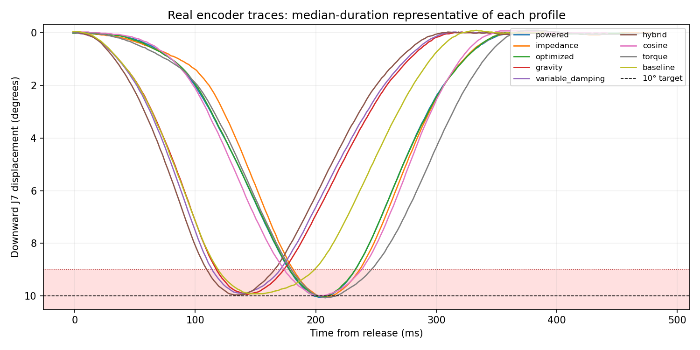

# J7 strike experiment — physical results, 2026-10-02

> **Historical setup:** These measurements used the centered, unloaded arm.
> The current program now prepares via record3 and allows an editable depth;
> these results and profiles have not been revalidated at that posture with a
> permanently attached stick. See [EXPERIMENT.md](EXPERIMENT.md) for current use.

## What was tested

The real right arm, **without a stick, cymbal, recording, camera, microphone, or
ESP32**. Preparation closed the gripper and moved to the custom right center.
During strikes, only J7 received moving goals; the other right motors held their
centered positions. The left arm was not enabled. Motion notifications were
explicitly waived by the user for this experiment.

Every method's reference bottom is **10.000° down from a fixed session anchor**.
No target-depth parameter was adjusted to exploit the scoring threshold. The
accepted measured bottom remained **9.8–10.2°** throughout; no tolerance widening
was used to rescue results. The measured zone is **strictly >9°**, including
descent, turnaround, ascent, and any reentries. Raw timestamped encoder crossings
are linearly interpolated; duplicate feedback does not become another sample.

This is an **unloaded kinematic proxy**, not measured cymbal contact time, impact
force, rebound, or tone. A stick and a real contact would change the dynamics.

## Conclusion and usable program

The practical recommendation is **lightly damped gravity descent with predictive
catch and a continuously shaped withdrawal** (`gravity`). Its main comparison
achieved **200/200 strict passes**, approximately **56 ms in the lower zone**, and
approximately **401 ms for the full release/return/settling cycle**. A second
independent comparison passed another **200/200**, and the extended cadence check
passed **30/30**. That reduced
zone time by about **30% versus the tuned baseline** without a bottom dwell.

This is a recommendation among the best tested mechanisms, **not proof of a
uniquely fastest or globally optimal mechanism**. The fastest powered profiles
were only about 1–2 ms quicker in this comparison, below the typical approximately
4.3 ms crossing bracket. Gravity and hybrid were effectively tied. The hybrid's
extra initial powered kick did not produce a meaningful zone-time improvement.
Gravity is simpler and returns appreciably sooner than the powered profiles.

The standalone program now defaults to the calibrated gravity profile when
hardware is explicitly selected:

```bash
./experiment.sh                                      # simulation + buttons + RViz
./experiment.sh --hardware                           # calibrated gravity, buttons + RViz
./experiment.sh --hardware --method impedance        # another preserved method
```

Hardware uses [config/experiment_hardware_tuned.json](config/experiment_hardware_tuned.json)
unless an explicit configuration is supplied. Normal hardware starts still notify
and count down; the optional `--no-motion-notification` flag is for an expressly
authorized waiver. The existing beat programs were not changed or given these
profiles automatically.

## Main frozen comparison: all nine modes

Session: `experiment_results/hardware_final/20261002T163910-1a369985`.
Exact settings: [experiment_hardware_frozen.json](config/experiment_hardware_frozen.json).
Execution order: [job list 10](config/experiment_jobs/10_frozen_validation_endurance.json).

Each mode received 100 validation strokes and 100 mixed-interval endurance strokes.
Method order was shuffled in ten-stroke blocks. Endurance requested start intervals
of 0.5, 0.65, 0.8, 1.5, and 2 seconds, including consecutive 0.5-second intervals.
The entire comparison used one fixed anchor and unchanged source/settings.

**All 1,800 strokes reached the depth acceptance band.** Strict quality scoring
also checks return overshoot/settling, smoothness, command limiting, feedback
gaps, meaningful secondary reversals, creeping/staging, and release lateness.
Those additional checks produced 34 failures; none were discarded.

| Mode | Strict passes | Measured bottom range ° | Zone median / P95 ms | Median full cycle ms | Maximum upper overshoot ° |
|---|---:|---:|---:|---:|---:|
| powered | 197/200 | 9.957–10.067 | 54.77 / 55.56 | 477.4 | 0.066 |
| impedance | 199/200 | 9.913–10.110 | 54.93 / 55.82 | 483.3 | 0.066 |
| optimized spline | 196/200 | 9.957–10.067 | 54.40 / 55.27 | 478.2 | 0.066 |
| **gravity catch** | **200/200** | **9.891–10.023** | **55.88 / 57.88** | **401.1** | **0.110** |
| variable damping | 199/200 | 9.891–10.023 | 56.33 / 58.29 | 397.6 | 0.110 |
| hybrid kick/coast/catch | 200/200 | 9.847–10.001 | 56.07 / 57.66 | 392.1 | 0.110 |
| rounded sinusoid | 192/200 | 9.935–10.045 | 63.95 / 64.75 | 441.8 | 0.110 |
| torque-led reversal | 183/200 | 9.847–10.198 | 66.27 / 67.84 | 495.9 | 0.154 |
| tuned legacy-family baseline | 200/200 | 9.891–10.001 | 79.85 / 81.46 | 395.8 | 0.132 |

Statistics include failed measured attempts, not a successful-only subset.
The cycle includes the common 40 ms return settling requirement, not an artificial
pause at the bottom.

Failure details:

- Powered / spline / sinusoid: respectively 3 / 4 / 8 strokes exceeded the common
  **5% command-limiter-active fraction**. They still reached acceptable depth;
  limiting is a quality rejection, not a controller fault.
- Impedance and variable damping: one **feedback gap >10 ms** each, with otherwise
  valid motion. The data remain invalid rather than assuming what happened between
  missing samples. A specific cause of these isolated gaps was not established.
- Torque-led: one 0.154° upper overshoot (limit 0.15°) and 16 requested-start misses
  greater than 20 ms. Maximum lateness was 39.64 ms; the 0.5-second cadence left too
  little time for its return, readiness and between-trial processing.
- There were **no controller/transport aborts** during this frozen comparison.



The plot chooses the median-zone-duration representative of each profile, not its
prettiest trace. Full traces and every failure are retained.

### Why the automatic report does not declare a unique winner

The scorer deliberately reports `winner: null`. Besides the timing ties, the
validation-stage median depth spread among its all-pass candidates was 0.132°,
slightly greater than the predeclared 0.10° depth-matching rule. This rule was not
relaxed. Gravity versus baseline was depth-matched, and the complete endurance
comparison between gravity, hybrid and baseline was also depth-matched.
The practical recommendation must not be confused with a formal unique-winner claim.

## Bounded follow-up and final profiles

After the main comparison, one bounded robustness pass addressed the four weaker
profiles, preserving the original settings and results:

- Powered and optimized: bottom curvature 5 → 4.5, without slowing the prescribed
  down/up durations. The 20-stroke checks passed 20/20 each and reduced saturation.
- Sinusoid: duration 0.40 → 0.42 s. Its check passed 20/20; it traded a few
  milliseconds of zone time for more command margin.
- Torque-led: earlier return-gain blending, damping 0.8 → 1.0, and faster return.
  A 0.22-second return was rejected (11/20 upper-overshoot failures). A 0.23-second
  return passed 19/20, with no overshoot failures and one cadence miss; this was
  retained for independent validation rather than repeatedly chasing one lucky run.

Evidence: [robustness pass](diagnostics/strike_lab_hardware/robustness_followup.md),
[torque return check](diagnostics/strike_lab_hardware/torque_return_finish.md),
and immutable sessions under `experiment_results/hardware_followup/`.

The updated profiles were then frozen for another 100 validation and 100 endurance
trials each, with unchanged gravity as a contemporaneous reference. No further
tuning was performed after this independent follow-up.

Session: `experiment_results/hardware_followup_final/20261002T170630-0b488056`.
Exact order and settings: [job list 13](config/experiment_jobs/13_followup_validation_endurance.json)
(block shuffle seed 2026100213).

| Mode | Strict passes | Measured bottom range ° | Zone median / P95 ms | Median full cycle ms | Maximum upper overshoot ° |
|---|---:|---:|---:|---:|---:|
| powered, curvature 4.5 | 198/200 | 9.957–10.067 | 57.51 / 58.19 | 475.1 | 0.066 |
| optimized spline, curvature 4.5 | **200/200** | 9.957–10.045 | 57.13 / 57.88 | 474.3 | 0.022 |
| gravity, unchanged reference | **200/200** | 9.891–10.045 | **56.04 / 58.12** | **401.8** | 0.110 |
| sinusoid, 0.42 s | 197/200 | 9.935–10.045 | 67.12 / 67.82 | 465.7 | 0.110 |
| torque-led, revised return | 198/200 | 9.825–10.089 | 60.95 / 62.08 | 488.3 | 0.132 |

Again, **all 1,000 measured bottoms were in the acceptance band**. Powered and
torque each had two requested-start misses; sinusoid had two command-limiting
failures and one start miss. Maximum lateness was respectively 30.79, 23.94, and
34.30 ms. There were no upper-overshoot, feedback-gap or controller-fault failures
in this follow-up. The updated profiles are retained because they improve the
observed robustness/speed trade-off, not because every mode became flawless.

Gravity and spline remain measurement-tied; the follow-up's automatic report also
does not declare a unique winner. Its validation-stage depth-match check remained
unsatisfied across all eligible modes, while the gravity/spline endurance comparison
was depth-matched. Gravity's approximately 72 ms shorter complete cycle is a useful
practical distinction. Variable damping and hybrid offer no demonstrated zone-time
advantage over the simpler gravity method. The baseline and sinusoid are slower
through the lower zone; weak-feedback torque has more depth variation and less
cadence margin.

The separate **30/30 gravity cadence probe** used requested starts 0.45, 0.45, 0.6,
1.5, 3 and 5 seconds apart. Its median zone time was 57.08 ms, bottom range
9.913–10.067°, maximum return overshoot 0.066°, and maximum start lateness 4.14 ms.
This checks short bursts and longer stationary holds without pooling that different
protocol into the 200-trial comparison. Peak reported temperature reached 40°C.

[Full follow-up statistics](diagnostics/strike_lab_hardware/followup_comparison.json)
and [representative traces](diagnostics/strike_lab_hardware/followup_comparison.png)
are saved alongside the original comparison. No failed candidate was deleted.

## What changed during physical calibration

All nine modes received real-arm tuning, not just the initially promising ones.
The search was finite and hand-directed from measured traces: descent/return
durations, bottom curvature, tracking gains, inertia/load feedforward, fall damping,
catch latency/braking, catch-to-return acceleration, spline shape, and pulse timing.
All attempted settings and source versions remain saved.

Important findings and fixes:

1. **Separate stroke feedforward from hold adaptation.** A changing static-hold
   integral was changing later strikes. Each calibrated stroke now uses its fixed
   `load_torque`; the hold integral only corrects the stationary return/anchor.
2. **Plan the actual turnaround to 10°.** The sampled gravity trigger could start
   late and plan a deeper bottom. The lab catch solver fits its stopping curve to
   the same 10° target, while preserving continuous acceleration into withdrawal.
3. **No zero-acceleration pause at the bottom.** Stronger, smooth bottom curvature
   and joined withdrawal reduced dwell substantially. Return braking is spread
   toward the top instead of a hard endpoint correction.
4. **Fresh feedback at release.** A stale USB/CAN hold reply is no longer allowed
   to masquerade as the first fresh strike measurement.
5. **Clean setup and shutdown.** Preparation has a bounded allowance for the
   observed MIT-arming velocity transient. Disable verification waits for the short
   TX queue to drain before sending its query burst. Earlier failed setup/cleanup
   attempts are retained; later completed batches confirmed relaxation normally.
6. **Keep the real scoring strict.** Small correction inside the accepted top
   settling band is not classified as another strike, but upper overshoot remains
   independently limited to 0.15°. The depth and timing acceptance rules were not
   loosened. Idle scheduling now avoids fixed-step sleep overshoot at requested
   next-start times.

The `baseline` is a tuned legacy-controller *family*, not a byte-for-byte untouched
historical controller: its experiment-only wrapper shares the exact-target and
fixed-load corrections. `camera_playback/mit_strike.py` itself remains unchanged.

## Limits and interpretation

- Shared tested envelope: 500 Hz control, 3 Nm estimated total command torque,
  3 rad/s commanded velocity, 80 rad/s² reference acceleration, 8000 rad/s³
  reference jerk, and 300 Nm/s torque slew. These are **not measured hardware maxima**.
- Torque is an estimate from the MIT PD/feedforward command, not a force sensor.
- Emergency corridor: 12° down / 0.6° above anchor. The scoring band remains much
  tighter: 9.8–10.2° bottom and at most 0.15° upper overshoot.
- Frozen main-run peak reported J7 temperature was 38°C. This finite unloaded
  experiment does not establish indefinite thermal endurance or loaded reliability.
- Gravity means no downward drive during the fall (`kp=0`, feedforward torque zero,
  low velocity damping); its catch and return are actively controlled. It is not a
  mechanically disconnected stick or a proof of a human-like bounce.
- Do not use a no-stick winner as proof of sound quality. Loaded posture/contact
  calibration would be a separate experiment; no such test was performed here.

## Reproducible evidence and checks

- [Experiment instructions](EXPERIMENT.md), [all main-run data](diagnostics/strike_lab_hardware/frozen_comparison.json),
  [main-run CSV summary](diagnostics/strike_lab_hardware/frozen_comparison.csv).
- `config/experiment_jobs/01_…` through `13_…`: finite tuning and frozen execution
  lists, including unsuccessful candidates.
- Every session contains `session.json`, source snapshot/hash, events, and each
  trial's parameters, timestamped `trace.csv`, and `score.json`. Original records
  are not overwritten by reports. Older session metadata has a stale
  `initial_tuning_not_calibrated` field from the software phase; calibration claims
  here are grounded in the actual hardware traces and exact parameter identities,
  not that obsolete label. New sessions record configuration provenance explicitly.
- Main-run report regeneration (offline, no hardware access):

  ```bash
  python3 diagnostics/strike_lab_hardware/build_report.py \
    experiment_results/hardware_final/20261002T163910-1a369985 \
    --output diagnostics/strike_lab_hardware/frozen_comparison --plot
  ```

- **344 offline regression tests passed** after the hardware-driven changes:
  [test log](diagnostics/strike_lab_hardware/final_software_regressions.txt).
  Physical CAN creation was forbidden by the lab test audit hook.
- Final offline GUI and full launcher checks also passed all nine synthetic modes,
  with clean shutdown: [Tk check](diagnostics/strike_lab_hardware/final_offline_ui.txt),
  [Tk + RViz check](diagnostics/strike_lab_hardware/final_offline_launch.txt).
- The original beat/controller protected-file hashes still match
  `diagnostics/strike_lab_hardware/protected_before.sha256`.

### Completion checks and complete inventory

- **3,727 recorded hardware attempts across 19 sessions**, including rejected,
  aborted, screening, tuning, confirmation, validation, cadence and UI attempts.
  3,416 passed their contemporaneous strict checks; exploratory failures are not
  silently omitted or confused with the final frozen profiles. There are 192
  method/parameter/source-version combinations in the saved exploration index.
- Every mode was physically exercised and tuned: baseline 290 attempts, cosine
  522, gravity 517, hybrid 284, impedance 261, optimized 481, powered 522, torque
  566, and variable damping 284. These totals deliberately include unsuccessful
  earlier configurations; compare exact profiles using the tables above instead
  of ranking these unequal exploratory totals.
- [Complete machine-readable summary and exploration index](diagnostics/strike_lab_hardware/complete_data.json),
  [one CSV row per attempt](diagnostics/strike_lab_hardware/complete_data_all_attempts.csv),
  and [session inventory](diagnostics/strike_lab_hardware/complete_data.md).
- The normal **Tk + RViz hardware launch passed three further gravity strokes**
  using the new defaults (3/3), displayed the live robot and results, then shut
  down cleanly with ordinary process-group Ctrl-C. Screenshots were inspected:
  [control window](diagnostics/strike_lab_hardware/hardware_panel.png),
  [RViz](diagnostics/strike_lab_hardware/hardware_rviz.png).
  [UI evidence](diagnostics/strike_lab_hardware/hardware_ui_result.json).
- After shutdown, a **480-frame audited state-query-only check confirmed all 16
  motors disabled**. Both CAN interfaces were ERROR-ACTIVE at 1 Mbit/s, current
  TX/RX error counters zero. See [postflight](diagnostics/strike_lab_hardware/postflight.json)
  and [CAN state](diagnostics/strike_lab_hardware/postflight_can.txt). No physical
  controller was left running or holding the arm.
- [Protected-file verification](diagnostics/strike_lab_hardware/protected_after.txt)
  confirms the legacy beat launcher/controllers stayed unchanged.
- [Source and held-joint audit](diagnostics/strike_lab_hardware/source_and_hold_audit.json)
  confirms current executable source and calibrated-profile hashes match the final
  tested snapshot. Across 599,510 main/follow-up trace rows, maximum absolute
  deviations from the centered J1–J6 goals were respectively 0.253°, 0.033°, 0.033°,
  0.165°, 0.039°, and 0.033°; no held-joint guard tripped.
